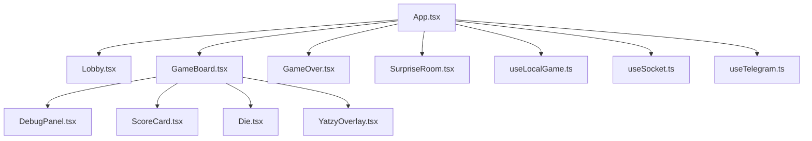

# 🗺️ Карта проекта: Yatzy Telegram Mini App

Этот документ содержит структурированную сводку по всем важным частям кодовой базы, архитектурным модулям и ссылкам на ключевые файлы проекта.

---

## 📌 Быстрая навигация по структуре

---

## 🎨 1. Пользовательский интерфейс и Рендеринг (UI)

Все основные компоненты интерфейса находятся в директории `client/src/components/`.

| Компонент | Файл разметки и логики | Стили | Назначение |
| :--- | :--- | :--- | :--- |
| **Главное лобби** | [Lobby.tsx](./client/src/components/Lobby.tsx) | [Lobby.css](./client/src/components/Lobby.css) | Ввод имени, выбор аватара, создание и подключение к комнатам. Обрабатывает чит-коды `DEBUG` и `SONYA`. |
| **Игровое поле** | [GameBoard.tsx](./client/src/components/GameBoard.tsx) | [GameBoard.css](./client/src/components/GameBoard.css) | Отображает состояние игры, кубики, таблицы очков. Управляет ходом игрока. |
| **Панель дебага** | [DebugPanel.tsx](./client/src/components/DebugPanel.tsx) | [DebugPanel.css](./client/src/components/DebugPanel.css) | Встраиваемая панель для тестирования математики игры: подмена значений кубиков, откат ходов, автозаполнение. |
| **Панель результатов** | [GameOver.tsx](./client/src/components/GameOver.tsx) | [GameOver.css](./client/src/components/GameOver.css) | Выводит финальный счет, определяет победителя, обрабатывает предложения реванша. |
| **Интерактивный торт** | [SurpriseRoom.tsx](./client/src/components/SurpriseRoom.tsx) | [SurpriseRoom.css](./client/src/components/SurpriseRoom.css) | Комната-поздравление с задуванием интерактивных свечей и конфетти. |
| **Кубик** | [Die.tsx](./client/src/components/Die.tsx) | [Die.css](./client/src/components/Die.css) | Трехмерный кубик с анимацией вращения и золотым свечением при Яцзи. |
| **Праздничный оверлей** | [YatzyOverlay.tsx](./client/src/components/YatzyOverlay.tsx) | [YatzyOverlay.css](./client/src/components/YatzyOverlay.css) | Полноэкранный эффект "YATZY!" с конфетти при выпадении 5 одинаковых кубиков. |

---

## ⚙️ 2. Управление состоянием и Логика (React Hooks)

Бизнес-логика игры инкапсулирована в пользовательских хуках в папке `client/src/hooks/`.

- **Локальный режим игры**: [useLocalGame.ts](./client/src/hooks/useLocalGame.ts)
  - Управляет стейт-машиной игры против бота.
  - Содержит логику дебаг-функций: `debugUndo`, `debugSetDice`, `debugForceFinish`, `debugSetUpperScore`, `debugFillScores`.
  - Отвечает за логику выдачи бонусного броска за просмотр рекламы (`watchAdForBonusRoll`).
- **Сетевой режим игры**: [useSocket.ts](./client/src/hooks/useSocket.ts)
  - Подключается к Node.js-серверу по Socket.io.
  - Транслирует сетевые события (`roll_dice`, `toggle_hold`, `score_category`, `rematch`, `surrender`).
- **Интеграция с Telegram**: [useTelegram.ts](./client/src/hooks/useTelegram.ts)
  - Извлекает имя пользователя из WebApp SDK.
  - Управляет тактильной отдачей (Haptic Feedback) на смартфонах.

---

## 🧮 3. Математика Яцзи и Искусственный Интеллект

Правила подсчета очков дублируются на клиенте и сервере для защиты от читерства.

- **ИИ-Бот**: [botStrategy.ts](./client/src/bot/botStrategy.ts)
  - Реализует выбор кубиков для переброса и оптимальное распределение очков по категориям на основе текущего множителя LSC.
- **Подсчет очков (Клиент)**: [yatzy.ts](./client/src/utils/yatzy.ts)
  - Математические функции вычисления очков по категориям (`calculateScore`), проверки на Yatzy (`isYatzyRoll`) и подсчета верхней секции.
- **Подсчет очков (Сервер)**: [yatzyLogic.ts](./server/src/game/yatzyLogic.ts)
  - Авторитетная логика подсчета очков для мультиплеера.

---

## 🌐 4. Серверный слой (Node.js + Socket.io)

Сервер находится в директории `server/` и координирует мультиплеер.

- **Основной шлюз**: [index.ts](./server/src/index.ts)
  - Реализует менеджмент игровых комнат, сессий игроков и защиту от частого спама кнопкой броска (rate limiting).
  - **Session Recovery**: Хранит сессию отключившегося игрока 3 минуты. При успешном вызове `reconnect_session` восстанавливает состояние игры.

---

## 📈 5. Документы внедрения и Планы изменений

В корневом каталоге проекта находятся планы реализации и исторический контекст фич:

- [LSC_UPDATE_PLAN.md](./LSC_UPDATE_PLAN.md) — Документ по изменению логики накопительного множителя Lucky Streak.
- [YATZY_BONUS_PLAN.md](./YATZY_BONUS_PLAN.md) — Спецификация правила дополнительного Yatzy (Yatzy Bonus).
- [YATZY_VISUAL_EFFECTS_PLAN.md](./YATZY_VISUAL_EFFECTS_PLAN.md) — Черновик реализации визуальных эффектов (конфетти, свечение).
- [YATZY_EFFECTS_EXECUTION_PLAN.md](./YATZY_EFFECTS_EXECUTION_PLAN.md) — План внедрения анимаций и оверлеев.
- [DEBUG_ROOM_IMPLEMENTATION_PLAN.md](../DEBUG_ROOM_IMPLEMENTATION_PLAN.md) — План реализации комнаты разработчика.
